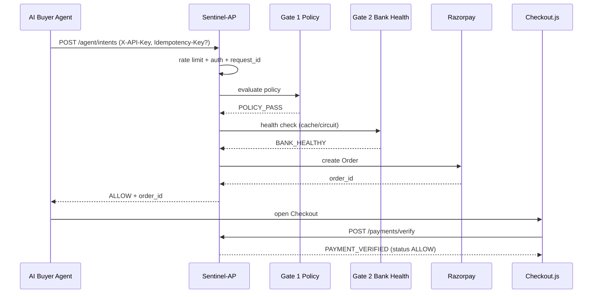
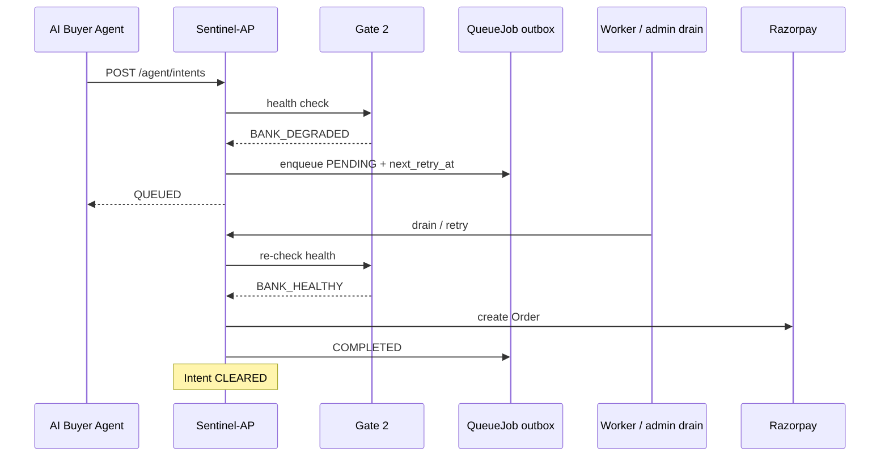
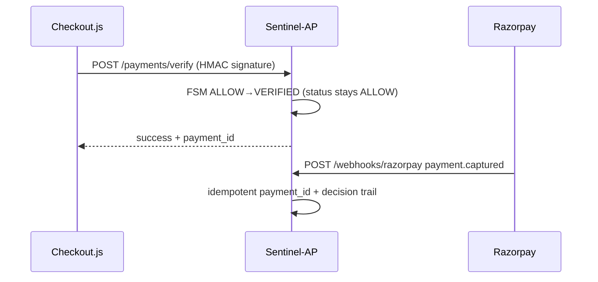

# Sentinel-AP Architecture (v1.3)

## Purpose

Sentinel-AP is a **payment control plane** between autonomous AI buyer agents and Razorpay.
Agents never talk to Razorpay directly. Every spend intent is evaluated by two gates, then
(optionally) turned into a Razorpay Order + Checkout flow with signature verify and webhooks.

## Layered planes

| Plane | Responsibility | Code |
|-------|----------------|------|
| **Ingress** | Auth (`X-API-Key`), rate limit, `Idempotency-Key`, `X-Request-Id` | `api/agent.py`, `core/rate_limit.py`, `middleware/request_id.py` |
| **Control plane** | Gate 1 Policy + Gate 2 Bank Health + Intent FSM | `services/policy_engine.py`, `bank_health.py`, `intent_fsm.py`, `gate_pipeline.py` |
| **Execution plane** | Razorpay Orders / Checkout verify / webhooks | `services/razorpay_client.py`, `api/payments.py`, `api/webhooks.py` |
| **Reliability plane** | Soft-fail `QueueJob` outbox (`next_retry_at`, attempts FSM), ARQ worker + admin drain | `gate_pipeline.drain_due_jobs`, `workers/tasks.py`, `POST /admin/queue/drain` |
| **Observability** | Audit events, decision trail, metrics, structured JSON logs | `services/audit.py`, `api/metrics.py`, `core/logging_utils.py` |

Public JSON diagram: `GET /api/v1/public/architecture` (also `GET /api/v1/admin/system`).

## Intent state machine

Enforced in **`services/intent_fsm.py`** (single source of truth):

```
PENDING ──► HARD_BLOCK          (Gate 1 fail — terminal)
   │
   ├──► QUEUED ──► CLEARED      (Gate 2 degraded → retry success)
   │         └──► FAILED        (queue exhausted)
   │
   ├──► ALLOW ──► VERIFIED      (Checkout verify / webhook — logical)
   │
   └──► FAILED                  (Razorpay order error)
```

**API compatibility:** public status values remain `ALLOW | HARD_BLOCK | QUEUED | CLEARED | FAILED`.
`PENDING` is transient (pre-gate). `VERIFIED` is logical — persisted status stays `ALLOW`/`CLEARED`
with decision `reason_code=PAYMENT_VERIFIED`.

### Domain results (typed)

Pipeline orchestrates only; gates return frozen dataclasses:

- `PolicyDecision` — Gate 1
- `HealthDecision` — Gate 2
- `PaymentDispatch` — execution plane

See `app/domain/decisions.py`.

## Unit of work

Request-scoped SQLAlchemy session (`get_db`) commits once at the end of the request.
Gate decisions + intent status + queue job + audit rows for one intent path share that
transaction (flush mid-pipeline; commit on success / rollback on exception).

## Gate 1 — Policy (deterministic Hard Block)

- Per-transaction amount cap (`max_amount_paise`)
- Daily budget (`daily_budget_paise`) against today's ALLOW/QUEUED/CLEARED spend
- SKU whitelist (if non-empty) and blacklist
- Currency allow-list

Outcomes are **deterministic** — same inputs → same reason codes (`AMOUNT_CAP_EXCEEDED`,
`SKU_BLACKLISTED`, `DAILY_BUDGET_EXCEEDED`, …). No LLM in the money path.

## Gate 2 — Bank health (Soft-Fail Queue)

- Pre-flight success-rate check vs org threshold (default 95%)
- **TTL cache** (~5s) to avoid hammering Razorpay on every intent
- **Circuit breaker**: after N consecutive probe failures, circuit opens ~30s and returns degraded
- Degraded → `QUEUED` + durable `QueueJob` (no Razorpay call)
- Recovered → worker / `POST /admin/queue/drain` / manual retry → Order → `CLEARED`

### Failure modes

1. Forced demo override — immediate, bypasses cache  
2. Cache HIT — reuse last probe within TTL  
3. Circuit OPEN — skip live HTTP; treat as degraded  
4. Live 5xx / network error — count toward circuit; low success rate  
5. Live 2xx/4xx — rail reachable; ~0.99 success rate  

## Sequence diagrams

### Agent happy path (ALLOW → Checkout)



### Hard block

```mermaid
sequenceDiagram
  participant Agent as AI Buyer Agent
  participant API as Sentinel-AP
  participant G1 as Gate 1 Policy

  Agent->>API: POST /agent/intents (blacklisted SKU / over cap)
  API->>G1: evaluate
  G1-->>API: HARD_BLOCK + reason_code
  Note over API: No Razorpay call; audit + decision written
  API-->>Agent: HARD_BLOCK
```

### Soft-fail retry



### Checkout + webhook



## Components

| Layer | Tech | Role |
|-------|------|------|
| API | FastAPI 1.3.x | Intent pipeline, admin, payments, webhooks, metrics, architecture |
| DB | PostgreSQL | Orgs, agents, policies, intents, decisions, queue, audit, idempotency |
| Cache / queue | Redis + ARQ | Soft-fail retries (worker optional; DB outbox + drain always works) |
| Payments | Razorpay Orders + Checkout | Amounts in **paise**; test keys in Render |
| Web | Next.js 14 | Landing + pitch deck, playground, dashboard |

## Cross-cutting

- **Idempotency-Key** → `idempotency_records` unique on `(agent_id, key)`
- **X-Request-Id** middleware — echoed on every response; stored in intent metadata / audit
- **Structured logs** — JSON with `request_id`, `intent_id`, `gate`, `outcome`, `reason_code`
- **Metrics** — `GET /api/v1/public/metrics`
- **Errors** — consistent JSON `{ error, message, status_code, request_id }`

## Trust boundaries

- Agent API key never reaches Razorpay
- Razorpay secret never reaches the browser (only `key_id`)
- Admin JWT for dashboard / bank simulation / queue retry / drain
- Demo credentials are intentional for Buildathon judges

## Deploy topology

- **API**: Render Docker (`sentinel-api-ecw9.onrender.com`)
- **Web**: Vercel (`sentinel-ap.vercel.app`) with `NEXT_PUBLIC_API_URL`
- **Worker**: Render ARQ worker (may be suspended — enqueue + manual clear / drain still demoable)
